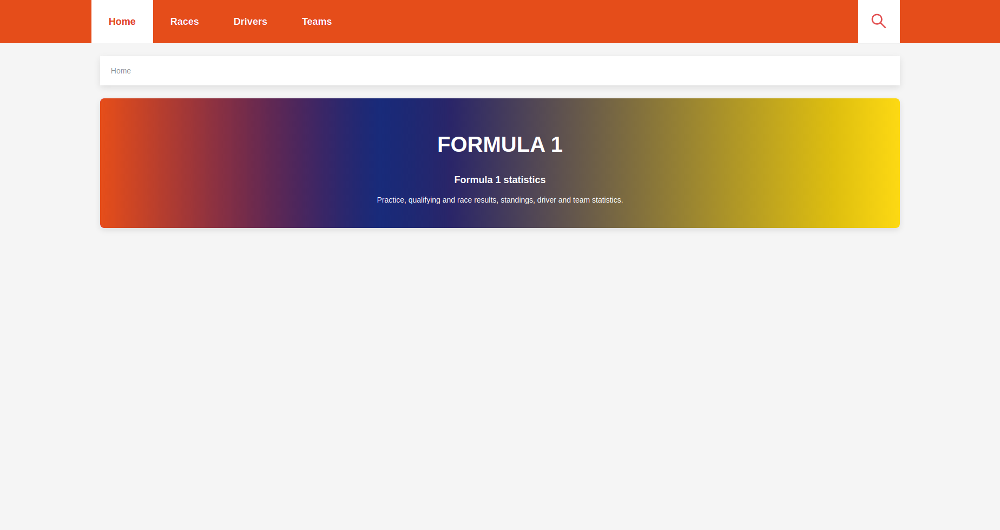
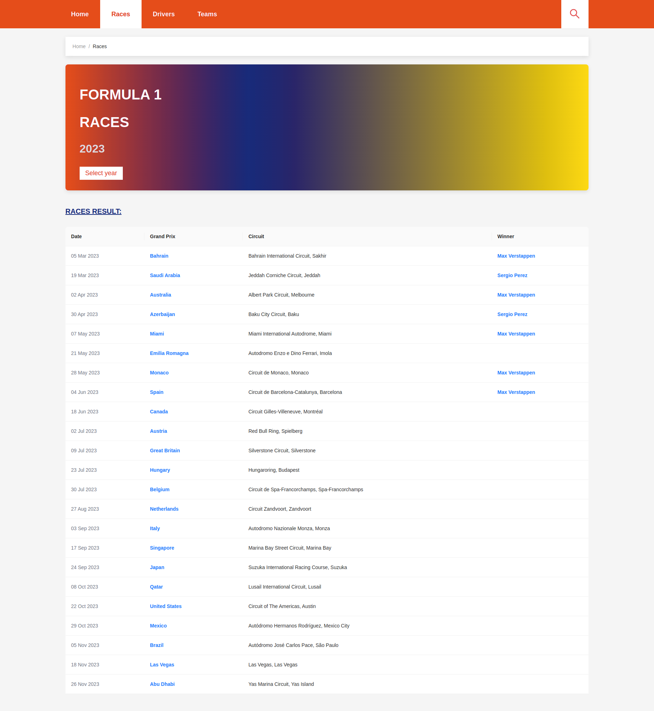
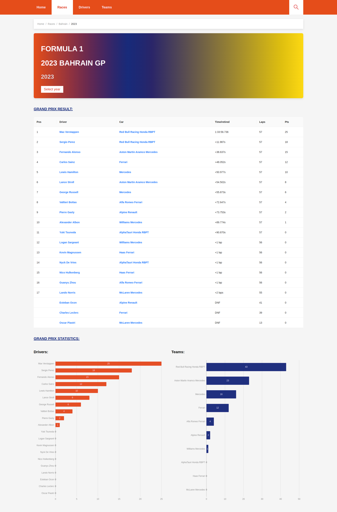
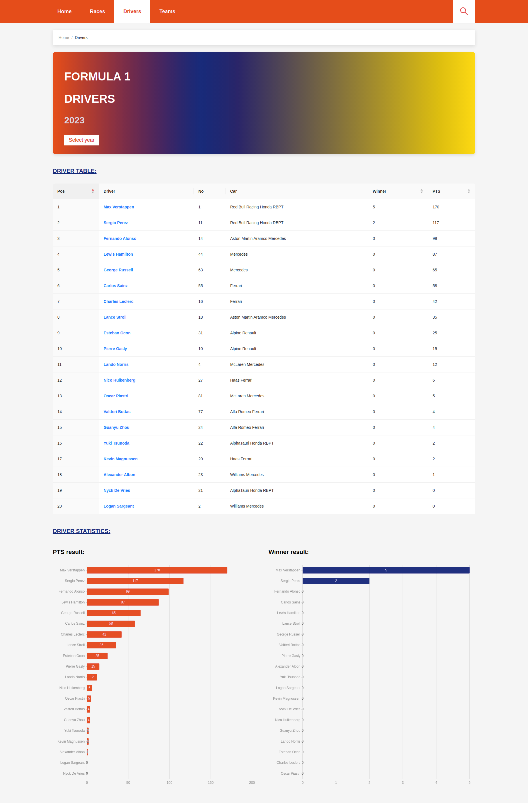
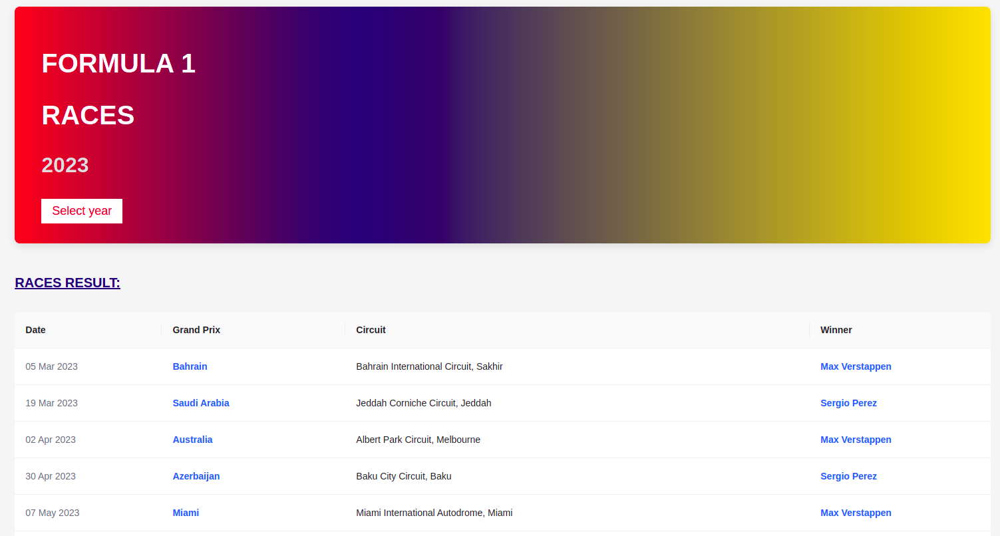
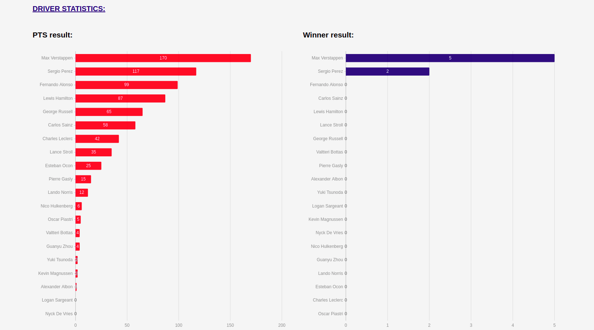
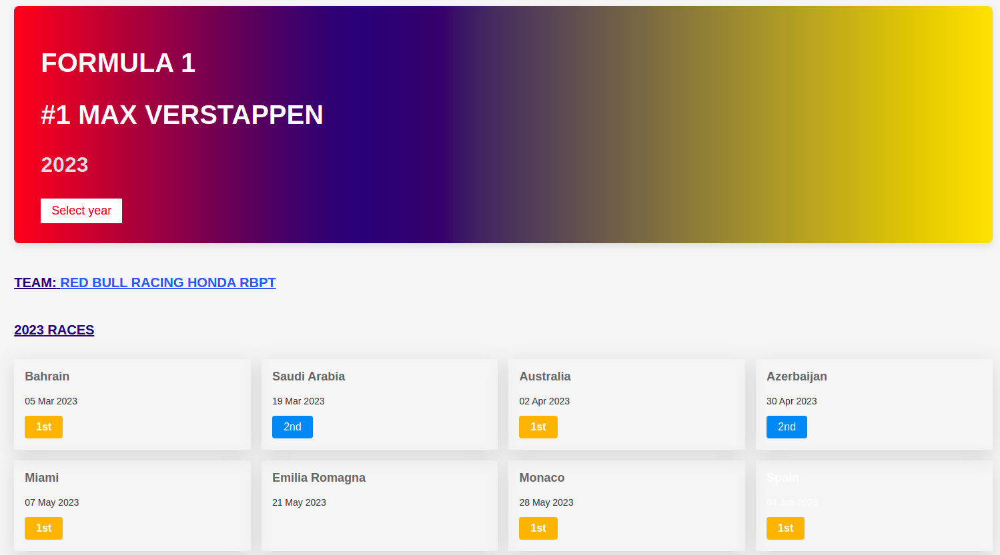
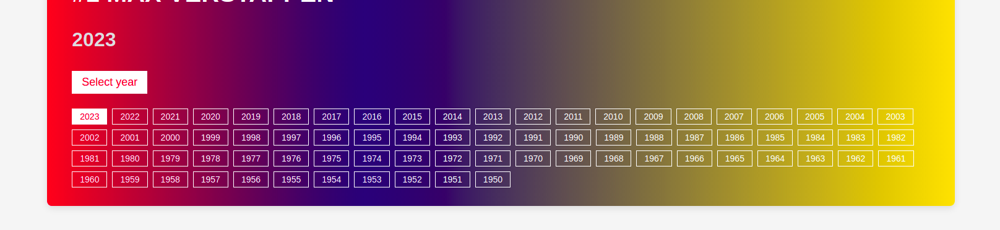
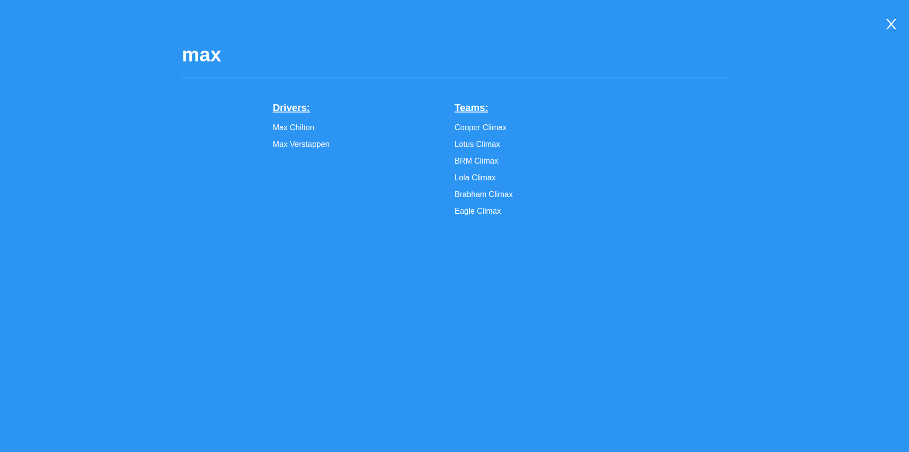

# FORMULA 1 STATISTICS

An application used to search, retrive and view Formula 1 database from 1950 to present. This app built with Vite, React, Typescript, SCSS, react-rounter-dom.

## Project Status

Complete

## Project Screen Shot(s)

Home page:

And some screen shot of this app:

 
 
 
...

You can view all screen shots in `public/screen_shots` folder

## Installation and Setup Instructions

Clone down this repository. You will need `node` and `npm` installed globally on your machine.

Installation packages:

`yarn`

To Start Server:

`yarn dev`

To Visit App:

`localhost:5173`

## Guide

### Navbar

 

After going home page. You can use this navbar for explore data.
Click races for races informarion, drivers for drivers information, teams for teams information.
Click search icon for open search page.

### Page content

 
 
 

Each page have title and showed data. Some pages like drivers or teams have chart under table.  
In each item, you can click to link or item to navigate to the respective page.

 

In title component, you can click to button "Change year" to redirect to the selected year (Same page).

 

You can search all information here (to open this modal, you can click to search button in navbar).

## Reflection

This project is made to submit for INTERVIEW ASSIGNMENT FOR THE POSITION OF FRONTEND PROGRAMMER of VRILLAR VIETNAM. It took me 4 days (about 30 working hours) for this project.
